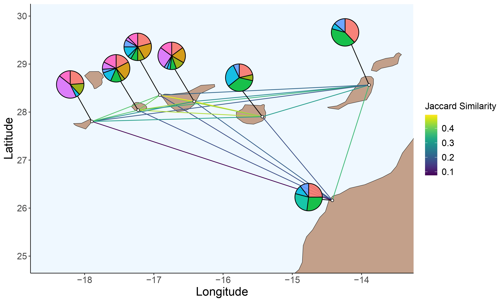

```{r setup, include=FALSE}
knitr::opts_chunk$set(echo = FALSE, results = "asis", message=FALSE, warning=FALSE, cache=TRUE, eval = TRUE, dev = c('png'), out.width = '100%', out.height='40%')
```


```{r load libraries, echo=FALSE, message=FALSE, warning=FALSE}
library(infomapecology)
library(igraph)
library(bipartite)
library(tidyverse)
library(magrittr)
library(betalink)
library(readxl)
library(ggalluvial)
library(scatterpie)
library(reshape2)
library(ggforce)
library(ggmap)
library(ggraph)
library(ggpubr)
rm(list=ls())
```

\
\
\

# Distance decay
A well-documented phenomenon in nature is distance decay— the decreasing species similarity between two locations
as the distance between them increase. However, studies addressing distance decay in community structure are rare. 
\
\
\

# Goal
We studied how distance affects the modular structure of a multilayer plant-pollinator network in the Canary Islands. In addition, we performed null models that explicitly control different components to disentangle the mechanisms behind distance decay patterns.
\
\
\

# Data
The study was conducted in The Canary Islands, where six islands and one location on the mainland were sampled. Distances between locations ranged from 52 to 450 kilometers. On each location, pollinator-plant interactions were recorded in two adjacent sites (from 50 to 500 meters apart) for a total of 14 sites. We aggregated data from any two adjacent sites on an island or mainland because we were interested in between-location spatial scale. 

```{r}
library(knitr)
Description <- read_excel("Location_description.xlsx")
kable(Description, align=c(rep('c',times=7)))

```
\
\
\

# Methods and Results
\

## Plant-pollinator multilayer network
Contained four components:

1. Seven layers (six islands and the mainland).

2. Two sets of nodes representing pollinator and plant species.

3. Intralayer directed weighted links representing pollinator-plant interactions within layers.

4. Interlayer weighted links connecting any species i to itself between two layers. Closer two layers are, the stronger is the interlayer link. Ecologically, closer distance increases the likelihood that spatial processes such as dispersal occur between two sites
\
\
\

## Distribution of intra and interlayer links
\
\
```{r}

intra_inter_data_for_distibution <- read.csv("intra_inter_data_for_distibution_islands_as_layers.csv")

intra_inter_data_for_distibution %>%
  ggplot(aes(x=values, fill=group))+ geom_histogram(position= "identity", alpha= 0.6, color= "black")+ theme_bw()+
  theme(panel.grid = element_blank(),
        panel.border = element_rect(color = "black",fill = NA,size = 1),
        panel.spacing = unit(0.5, "cm", data = NULL),
        axis.text = element_text(size=14, color='black'),
        axis.title = element_text(size=14, color='black'),
        axis.line = element_blank())

```
\

## Null models overview
\
\
```{r out.height = "460px", out.width='800px', fig.cap= "Null models for spatial multilayer networks. The networks depicted are bipartite multilayer networks that contain two sets of nodes (circles and squares), layers (polygons), intralayer links (solid lines) and interlayer links (dashed lines). For simplicity we only color one set of nodes (besides C). (A) in M1 we shuffled the occurrence of species in layers. In this example we switched the brown and cyan nodes. These switched generate new interlayer links (dashed blue lines). (B) In M2 we shuffled intralayer links (blue solid lines). This is the classical way of shuffling in monolayer networks. (C) In M3 we shuffle interactions between layers. In this example the green and yellow nodes co-occur in all three layers but interact only in the upper layer. After the shuffling they now interact in the middle layer (blue solid line). (D) In M4 we fixed the interlayer edge weights (depicted by line width) to a uniform value equal to the median of the weight distribution (all blue dashed lines are the same width).", echo=F}
knitr::include_graphics("null_models.png")
```
\

## Species distance decay
\
We calculated Jaccard similarity of species identity between islands and tested distance decay using a linear regression model.
\
\

### Species distance decay - Empirical data
\
We observed species distance decay between islands in the empirical data ($R^2$ = 0.74, P < 0.001), which indicates that islands tended to share less species with increasing distance.
\
\
```{r}

classic_layers_turnover_with_distances_island <- read.csv("classic_layers_turnover_with_distances_islands_as_layers.csv")

classic_layers_turnover_with_distances <- classic_layers_turnover_with_distances_island %>% 
  mutate(distance_in_km=mean_distance/1000) #turn to km


classic_layers_turnover_with_distances %>%
  ggplot(aes(x=distance_in_km, y=turnover))+ geom_point(color = "indianred2")+ theme_classic()+ 
  stat_smooth(method= "lm", se=F, color = "indianred2")+
  theme(axis.title=element_text(size=22))+theme(axis.text.x=element_text(size=15))+
  theme(axis.text.y=element_text(size=15))+
  labs(x="Distance in Km", y="Jaccard Similarity")+
  stat_cor(aes(label = after_stat(rr.label)), label.x = 400, label.y = c(0.36, 0.34, 0.32, 0.30))+
  theme(panel.grid = element_blank(),
        panel.border = element_rect(color = "black",fill = NA,size = 1),
        panel.spacing = unit(0.5, "cm", data = NULL),
        axis.text = element_text(size=14, color='black'),
        axis.title = element_text(size=14, color='black'),
        axis.line = element_blank())

```

\
\
\

### Species distance decay- Null model shuffling species between layers ($M_1$)
\
We compared the observed distance decay to that obtained using three versions of null model where we shuffled species (plants, pollinators and both) between layers. $M_1$ changes species labels and interlayer structure but not intralayer structure.
\
\
\

Redistributing plant, pollinator and both species among sites did not break species distance decay ($R^2_{M_1^P}$ = 0.68, P < 0.001; $R^2_{M_1^A}$ = 0.71, P < 0.001; $R^2_{M_1^{AP}}$ = 0.35, P = 0.004). The difference was more pronounced when shuffling both plant and pollinator species, which indicates that both species together have a stronger effect in distance decay.
\
\
```{r}

turnover_shuf_and_empirical <- read.csv("turnover_shuf_and_empirical_islands_as_layers.csv")

turnover_shuf_and_empirical %>% ggplot(aes(x= distance_in_km, y= ave, group= type, color= type))+
  geom_point()+ geom_errorbar(aes(ymin= ave-sd, ymax= ave+sd))+ theme_classic()+ geom_smooth(method= "lm", se=F)+
  labs(x="Distance in Km", y="Jaccard Similarity")+
  theme(panel.grid = element_blank(),
        panel.border = element_rect(color = "black",fill = NA,size = 1),
        panel.spacing = unit(0.5, "cm", data = NULL),
        axis.text = element_text(size=14, color='black'),
        axis.title = element_text(size=14, color='black'),
        axis.line = element_blank()) + stat_cor(aes(label = ..p.label..), label.x = 400)+
  stat_cor(aes(label = ..rr.label..), label.x = 400, label.y = c(0.36, 0.34, 0.32, 0.30))

```
```{r}
library(knitr)
Description <- read_excel("Table_models.xlsx", sheet = 1)
kable(Description, align=c(rep('c',times=6)))

```
\
\
\

## Modules distance decay
\
We calculated distance decay in structure in the same way as for species, but using module identities. In addition, we used multiple null models to disentangle the mechanisms behind the pattern found because differences in structure could emerge due to turnover in species composition or interaction rewiring.

### Modules distance decay - Empirical data
\
The spatial network was partitioned to 88 modules. Most (85) modules were found in more
than one island, while 3 modules were confined to a single island. Modules varied in size, ranging from 2 to 44 species, with an average of 7±1 species per module.
\
\

```{r}
Prop_sp_module_island <- read.csv("Prop_sp_module_island.csv") 

##-- Distribution of modules in islands with relative proportions according to modules
ggplot(Prop_sp_module_island, aes(x = module, y = layer_name, fill=Prop_sp )) +
  geom_tile(color='white') +
  theme_classic() +
  scale_fill_viridis_c(limits = c(0, 1)) +
  scale_x_continuous(breaks=seq(1,88,4)) +
  scale_y_discrete(limits = c("Hierro","Gomera","TenerifeTeno","TenerifeSouth","GranCanaria","Fuerteventura","WesternSahara"))+ labs(x='Module ID', y="Islands")

```
```{r}

Prop_sp_in_island <- read.csv("Prop_sp_in_island.csv") 

##-- Distribution of modules in islands with relative proportions according to island
ggplot(Prop_sp_in_island, aes(x = module, y = layer_name, fill=Prop_sp )) +
  geom_tile(color='white') +
  theme_classic() +
  scale_fill_viridis_c(limits = c(0, 0.20)) +
  scale_x_continuous(breaks=seq(1,88,4)) +
  scale_y_discrete(limits = c("Hierro","Gomera","TenerifeTeno","TenerifeSouth","GranCanaria","Fuerteventura","WesternSahara"))+
  labs(x='Module ID', y="Islands")

```
\
\
```{r out.height = "460px", out.width='800px', fig.cap= "Regional signature structure. Structure similarity between locations is indicated by lines. Lines color represents Jaccard similarity between locations. Pie charts indicate the spatial distribution of the nine biggest modules. The color and size of portions within pie charts represent module ID and the proportion of species integrating the module", echo=F}
knitr::include_graphics("Map_modules.jpg")
```
\
\
```{r out.height = "460px", out.width='800px', fig.cap= "Regional signature structure. Structure similarity between locations is indicated by lines. Lines color represents Jaccard similarity between locations. Pie charts indicate the spatial distribution of the nine biggest modules. The color and size of portions within pie charts represent module ID and the proportion of species integrating the module", echo=F}

```
\
\

We observed modules distance decay in the empirical data ($R^2$ = 0.67, P < 0.001), which indicates that islands tended to share less modules with increasing distance. However, decay in modules was weaker than for species.
\
\
```{r}

islands_turnover_with_distnace_empirical <- read.csv("islands_turnover_with_distnace_empirical.csv")

islands_turnover_with_distnace_empirical %>%
  ggplot(aes(x=distance_in_km, y=turnover))+
  geom_point(color = "indianred2")+ 
  scale_x_continuous()+ stat_smooth(method= "lm", se=F, color = "indianred2")+
  theme(axis.title=element_text(size=22))+theme(axis.text.x=element_text(size=15))+
  theme(axis.text.y=element_text(size=15))+
  labs(x="Distance in Km", y="Jaccard Similarity")+ theme_bw()+
  stat_cor(aes(label = after_stat(rr.label)), label.x = 400, label.y = c(0.36, 0.34, 0.32, 0.30))+
  theme(panel.grid = element_blank(),
        panel.border = element_rect(color = "black",fill = NA,size = 1),
        panel.spacing = unit(0.5, "cm", data = NULL),
        axis.text = element_text(size=14, color='black'),
        axis.title = element_text(size=14, color='black'),
        axis.line = element_blank())

```

\
\
\

### Modules distance decay- Null model shuffling species between layers ($M_1$)
\
Redistributing pollinator and pollinator and plant species among islands broke structure distance decay ($R^2_{M_1^A}$ = 0.11, P = 0.14; $R^2_{M_1^{AP}}$ = 0.14, P = 0.093) but not the redistribution plants ($R^2_{M_1^P}$ = 0.54, P < 0.001). This indicates that pollinator species contribute more to the distance decay pattern found in the empirical network.
\
\
```{r}
jaccard_similarity_layer_empirical_and_null_km <- read.csv("jaccard_similarity_layer_empirical_and_null_km_islands_m1.csv")


jaccard_similarity_layer_empirical_and_null_km %>% 
  ggplot(aes(x= mean_dist_in_km, y= ave, group= type, color= type))+
  geom_point()+ geom_errorbar(aes(ymin= ave-sd, ymax= ave+sd))+ theme_classic()+ geom_smooth(method= "lm", se=F)+
  theme(axis.title=element_text(size=22))+theme(axis.text.x=element_text(size=15))+
  theme(axis.text.y=element_text(size=15))+ theme(legend.title = element_text(size = 13), legend.text = element_text(size = 13))+
  labs(x="Distance in Km", y="Jaccard Similarity")+ 
  stat_cor(aes(label = after_stat(rr.label)), label.x = 400, label.y = c(0.60, 0.56, 0.52, 0.48))+
  theme(panel.grid = element_blank(),
        panel.border = element_rect(color = "black",fill = NA,size = 1),
        panel.spacing = unit(0.5, "cm", data = NULL),
        axis.text = element_text(size=14, color='black'),
        axis.title = element_text(size=14, color='black'),
        axis.line = element_blank()) + stat_cor(aes(label = ..p.label..), label.x = 400, label.y = c(0.76, 0.72, 0.68, 0.64))
 
```
\
```{r}
library(knitr)
Description <- read_excel("Table_models.xlsx", sheet = 2)
kable(Description, align=c(rep('c',times=6)), digits = c(0,3,5,3,3,0), format.args = list(scientific = FALSE))

```
\
\
In particular, redistributing pollinators and both plants and pollinators between islands affected the amount of variation explained by distance (P < 0.001); but not the redistribution of plant species (P = 0.997).


\
\
```{r}
correlation_empirical_pols <- read.csv("correlation_empirical_pols_islands.csv")
rqsuares_M1_all <- read.csv("rqsuares_M1_all_islands.csv")
group_color <- c(shuf_pollinators = "#BE75FA", 
                    shuf_plants = "#15B7BC",
                    shuf_both = "#72A323")

rqsuares_M1_all %>% 
  ggplot(aes(x = rsquared, fill = type))+ 
  geom_density(alpha = 0.4)+ 
  theme_classic()+ labs(x = "R squared")+
  geom_vline(xintercept = correlation_empirical_pols$rsquared, linetype = "dashed", color = "#F47069")+
  theme(axis.title=element_text(size=22))+
  theme(panel.grid = element_blank(),
        panel.border = element_rect(color = "black",fill = NA,size = 1),
        panel.spacing = unit(0.5, "cm", data = NULL),
        axis.text = element_text(size=14, color='black'),
        axis.title = element_text(size=14, color='black'),
        axis.line = element_blank())+
  scale_fill_manual(values = group_color)

```

\
\
\

### Modules distance decay- Null model shuffling interactions within layers ($M_2$)
\
We tested if local structure affects distance decay in structure by shuffling interactions within layers. $M_2$ changes the intralayer structure but conserves the interlayer structure of the network.

Shuffling local structure broke distance decay pattern in structure ($R^2_{M_2}$ = 0.12, P = 0.12) and had a significant effect on the overall structure variation explained by distance (P < 0.001).
\
\
```{r}
jaccard_similarity_layer_empirical_and_null_km_classic <- read.csv("jaccard_similarity_layer_empirical_and_null_km_classic_islands.csv") #need to read this to run next part

jaccard_similarity_layer_empirical_and_null_km_classic %>% 
  ggplot(aes(x= mean_dist_in_km, y= ave, group= type, color= type))+
  geom_point()+ geom_errorbar(aes(ymin= ave-sd, ymax= ave+sd))+ theme_classic()+ geom_smooth(method= "lm", se=F)+
  theme(axis.title=element_text(size=22))+theme(axis.text.x=element_text(size=15))+
  theme(axis.text.y=element_text(size=15))+ theme(legend.title = element_text(size = 13), legend.text = element_text(size = 13))+
  labs(x="Distance in Km", y="Jaccard Similarity")+ 
  stat_cor(aes(label = after_stat(rr.label)), label.x = 400, label.y = c(0.60, 0.56, 0.52, 0.48))+
  theme(panel.grid = element_blank(),
        panel.border = element_rect(color = "black",fill = NA,size = 1),
        panel.spacing = unit(0.5, "cm", data = NULL),
        axis.text = element_text(size=14, color='black'),
        axis.title = element_text(size=14, color='black'),
        axis.line = element_blank()) + stat_cor(aes(label = ..p.label..), label.x = 400)


```
\
\
```{r}
library(knitr)
Description <- read_excel("Table_models.xlsx", sheet = 3)
kable(Description, align=c(rep('c',times=6)), digits = c(0,3,8,3,3,0))

```
\
```{r}
correlation_empirical_classic <- read.csv("correlation_empirical_classic_islands.csv")
iteration_correlation_classic <- read.csv("iteration_correlation_classic_islands.csv")

iteration_correlation_classic %>% ggplot(aes(x = rsquared))+ 
  geom_density(fill = "#c4067c", color = "#c4067c", alpha = 0.4)+ 
  theme_classic()+ labs(x = "R squared")+
  geom_vline(xintercept = correlation_empirical_classic$rsquared, linetype = "dashed", color = "#F47069") 

```
\
\
\


### Modules distance decay- Null model shuffling interactions between layers ($M_3$)
\
We tested if interaction rewiring across islands affects distance decay in structure by shuffling interactions of each pair of species between all the islands in which they co-occur. $M_3$ shuffles intralayer links between islands but conserves the interlayer links.

```{r, message=FALSE}
message("For example, if a plant and a pollinator co-occurred in layers 1 and 3 but interacted only in layer 1, they would still co-occur in the same layers but may interact in layer 3 after shuffling")
```

\
Shuffling interactions between islands did not break distance decay pattern in structure ($R^2_{M_3}$ = 0.33, P = 0.006) but had a significant effect on the overall structure variation explained by distance (P < 0.001).
\
\
```{r}
jaccard_similarity_layer_empirical_and_null_km  <- read.csv("jaccard_similarity_layer_empirical_and_null_km_islands.csv") 

jaccard_similarity_layer_empirical_and_null_km %>% 
  ggplot(aes(x= mean_dist_in_km, y= ave, group= type, color= type))+
  geom_point()+ geom_errorbar(aes(ymin= ave-sd, ymax= ave+sd))+ theme_classic()+ geom_smooth(method= "lm", se=F)+
  theme(axis.title=element_text(size=22))+theme(axis.text.x=element_text(size=15))+
  theme(axis.text.y=element_text(size=15))+ theme(legend.title = element_text(size = 13), legend.text = element_text(size = 13))+
  labs(x="Distance in Km", y="Jaccard Similarity")+ 
  stat_cor(aes(label = after_stat(rr.label)), label.x = 400, label.y = c(0.60, 0.56, 0.52, 0.48))+
  theme(panel.grid = element_blank(),
        panel.border = element_rect(color = "black",fill = NA,size = 1),
        panel.spacing = unit(0.5, "cm", data = NULL),
        axis.text = element_text(size=14, color='black'),
        axis.title = element_text(size=14, color='black'),
        axis.line = element_blank()) + stat_cor(aes(label = ..p.label..), label.x = 400)


```
\
\
```{r}
library(knitr)
Description <- read_excel("Table_models.xlsx", sheet = 4)
kable(Description, align=c(rep('c',times=6)), digits = c(0,3,8,3,4,0))

```
\
```{r}

#distribution of rsquared and add empirical
correlation_empirical_interactions <- read.csv("correlation_empirical_interactions_islands.csv")
iteration_correlation_interactions <- read.csv("iteration_correlation_interactions_islands.csv")

iteration_correlation_interactions %>% ggplot(aes(x = rsquared))+ 
  geom_density(fill = "#0033cc", color = "#0033cc", alpha = 0.4)+ 
  theme_classic()+ labs(x = "R squared")+
  geom_vline(xintercept = correlation_empirical_interactions$rsquared, linetype = "dashed", color = "#F47069") 


```
\
```{r}

interactions_co_occurences <-read.csv("interactions_co_occurences.csv")

interactions_co_occurences_pot <- interactions_co_occurences %>%
  mutate(possible_changes = co_occurrences - interactions) %>% 
  summarise(co_occurrences = sum (co_occurrences), interactions = sum(interactions), possible_changes = sum(possible_changes)) %>% 
              mutate(Id = c(1))
interactions_co_occurences_pot2<- pivot_longer(interactions_co_occurences_pot, names_to = "group", values_to = "number", cols = -Id)

interactions_co_occurences_pot2 %>%
  ggplot(aes(x=group, y= number, fill=group))+ geom_bar(stat='identity', alpha= 0.6, color= "black")+ theme_bw()+
  scale_y_continuous(limits = c(0, 1200), breaks=seq(0,1200,300)) +
  theme(panel.grid = element_blank(),
        panel.border = element_rect(color = "black",fill = NA,size = 1),
        panel.spacing = unit(0.5, "cm", data = NULL),
        axis.text = element_text(size=14, color='black'),
        axis.title = element_text(size=14, color='black'))
```
\
\


### Modules distance decay- Beta diversity components
\
Shuffling species between islands deviates more from the empirical value than shuffling interactions between islands (Mann-Whitney U test, $R^2_{M_3}$ > $R^2_{M_2}$, P < 0.001), which indicates species turnover is the main driver of distance decay in structure.
\
\
```{r}

##compare both parts of beta diversity (shuffling pollinator species )
iteration_correlation_pols <- read.csv("iteration_correlation_pols_islands.csv")
iteration_correlation_interactions <- read.csv("iteration_correlation_interactions_islands.csv")
correlation_empirical_interactions <- read.csv("correlation_empirical_interactions_islands.csv")

interactions_for_beta_diversity <- iteration_correlation_interactions
interactions_for_beta_diversity$type <- "shuffling_interactions" 

species_for_beta_diversity <- iteration_correlation_pols
species_for_beta_diversity$type <- "shuffling_species"

correlation_beta_diversity <- rbind(interactions_for_beta_diversity, species_for_beta_diversity)

correlation_beta_diversity %>% ggplot(aes(x = rsquared, color = type, fill = type))+ #overlay shuffling of interactions and species
  geom_density(alpha = 0.4)+ scale_color_manual(values = c("#0033cc", "#BE75FA"))+ 
  scale_fill_manual(values = c("#0033cc", "#BE75FA"))+
  theme_classic()+ labs(x = "R squared")+
  geom_vline(xintercept = correlation_empirical_interactions$rsquared, linetype = "dashed", color = "#F47069") 

```

\
\
\

### Modules distance decay- Null model uniform value interlayerlinks ($M_4$)
\
To test the effect of distance between islands, we fixed the weight of all interlayer links to a uniform value equal to the median of all the interlayer weights in the network. $M_4$ maintains intralayer structure and the presence of interlayer links.

```{r, message=FALSE}
message("the reason why using a uniform value might not make a huge difference is that the interlayer edge weights distribution is quite narrow, meaning that using a uniform value won’t change most distances tremendously.")
```

\
Contrary to what we expected, fixing the same distance between islands produced a similar pattern of distance decay in modules as the empirical network ($R^2_{M_4}$ = 0.68, P < 0.001).
\
\
```{r}

jaccard_similarity_empirical_and_fixed_no_self_loop_km<- read.csv("jaccard_similarity_empirical_and_fixed_no_self_loop_km_islands.csv")

jaccard_similarity_empirical_and_fixed_no_self_loop_km %>% ggplot(aes(x= ave_dist_in_km, y= ave, group= type, color= type))+
  geom_point()+ geom_errorbar(aes(ymin= ave-sd, ymax= ave+sd))+ theme_classic()+ geom_smooth(method= "lm", se=F)+
  theme(axis.title=element_text(size=22))+theme(axis.text.x=element_text(size=15))+
  theme(axis.text.y=element_text(size=15))+ theme(legend.title = element_text(size = 13), legend.text = element_text(size = 13))+
  labs(x="Distance in Km", y="Jaccard Similarity")+ scale_color_manual(values = c("#F47069", "#c4ad06"))+
  theme(panel.grid = element_blank(),
        panel.border = element_rect(color = "black",fill = NA,size = 1),
        panel.spacing = unit(0.5, "cm", data = NULL),
        axis.text = element_text(size=14, color='black'),
        axis.title = element_text(size=14, color='black'),
        axis.line = element_blank()) + stat_cor(aes(label = ..p.label..), label.x = 400)+
 stat_cor(aes(label = ..rr.label..), label.x = 400, label.y = c(0.65, 0.62))
```
\
\
```{r}
library(knitr)
Description <- read_excel("Table_models.xlsx", sheet = 5)
kable(Description, align=c(rep('c',times=6)), digits = c(0,3,8,3,4,0))

```
\
\
\
```{r}

jaccard_similarity_empirical_and_fixed_km <- read.csv("sensitivity_nullmodel4.csv")

jaccard_similarity_empirical_and_fixed_km %>% 
  ggplot(aes(x= ave_dist_in_km , y= ave, group= trial, color= trial))+
  geom_point()+ theme_classic()+ geom_smooth(method= "lm", se=F)+
  theme(axis.title=element_text(size=22))+theme(axis.text.x=element_text(size=15))+
  theme(axis.text.y=element_text(size=15))+ theme(legend.title = element_text(size = 13), legend.text = element_text(size = 13))+
  labs(x="Distance in Km", y="Jaccard Similarity")+
  theme(panel.grid = element_blank(),
        panel.border = element_rect(color = "black",fill = NA,size = 1),
        panel.spacing = unit(0.5, "cm", data = NULL),
        axis.text = element_text(size=14, color='black'),
        axis.title = element_text(size=14, color='black'),
        axis.line = element_blank()) 
```
\
\
```{r}
library(knitr)
Description <- read_excel("Table_models.xlsx", sheet = 6)
kable(Description, align=c(rep('c',times=6)), digits = c(0,3,8,3,4,0))
```
\
\
\

# Main Results
\

* Regional signature structure using metacommunity approach

* Strong distance decay pattern in structure

* Distance decay pattern is mainly driven by species turnover (pollinators) and local processes occurring in each island.

